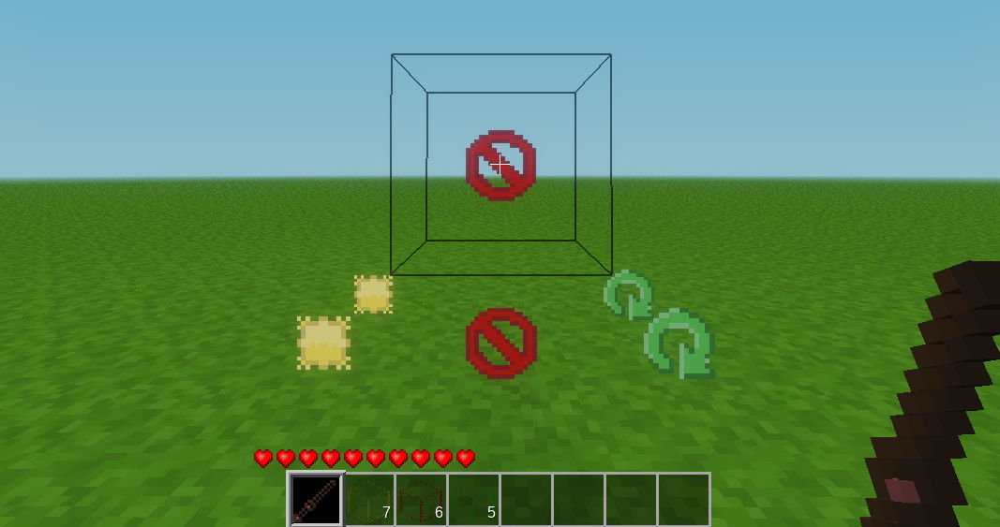

# InvisiBlocks

### by TenPlus1

This mod exists to add invisible blocks into the world that can be used as a barrier to stop players and mobs, along with invisible light sources to illuiminate areas and invisible mob walls a player can walk through but will make a mob stop and ponder.

 - Craft 8x Invisible Barrier with 8x glass and 1x stone top middle
 - Craft 8x Invisible Light with 8x glass and 1x meselamp top middle
 - Craft 8x Invisible Mob Wall with 8x glass and 1x wood top middle
 - Craft Show Stick with 1x stick and 1x invisible barrier on top
 - Use Show Stick to indicate where all invisible blocks are placed with specific icons
 - Right-Click with Show Stick to remove invisible block pointed at
 - Mob Walls only cause Mobs Redo mobs to stop
 - Toggle 'invisiblocks.hide_recipes' setting to hide all recipes for above items

## License:

 - Code is MIT
 - Textures are CC0

## Changelog:

 - 0.1 - Initial upload
 - 0.2 - Invisible blocks can only be removed by right-clicking with show stick
